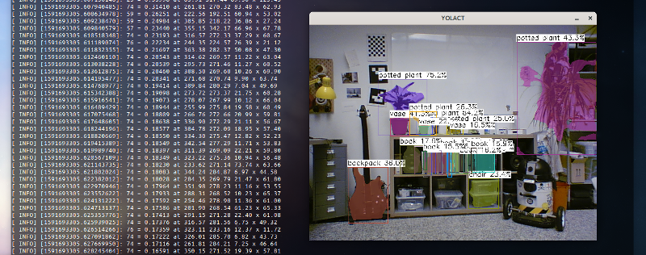
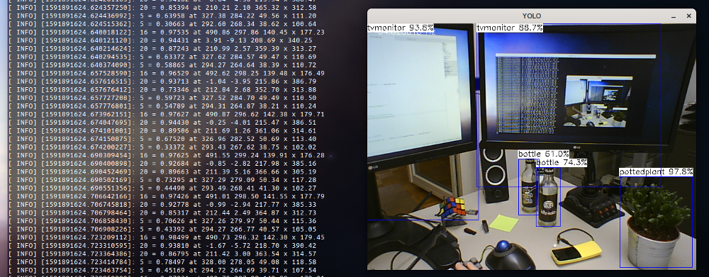
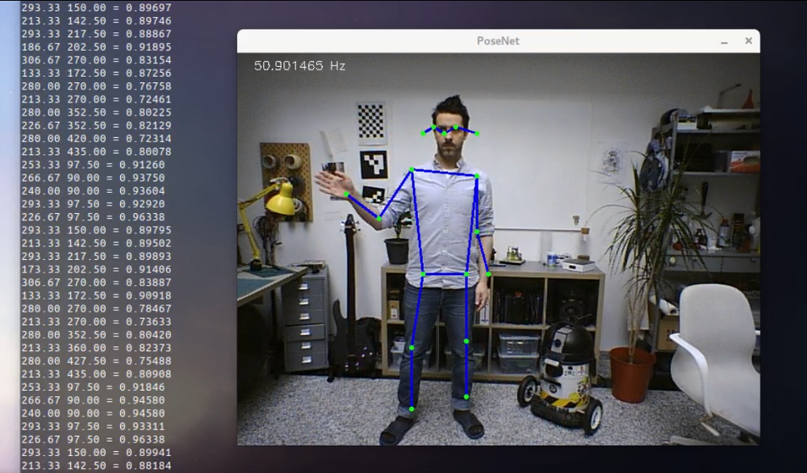
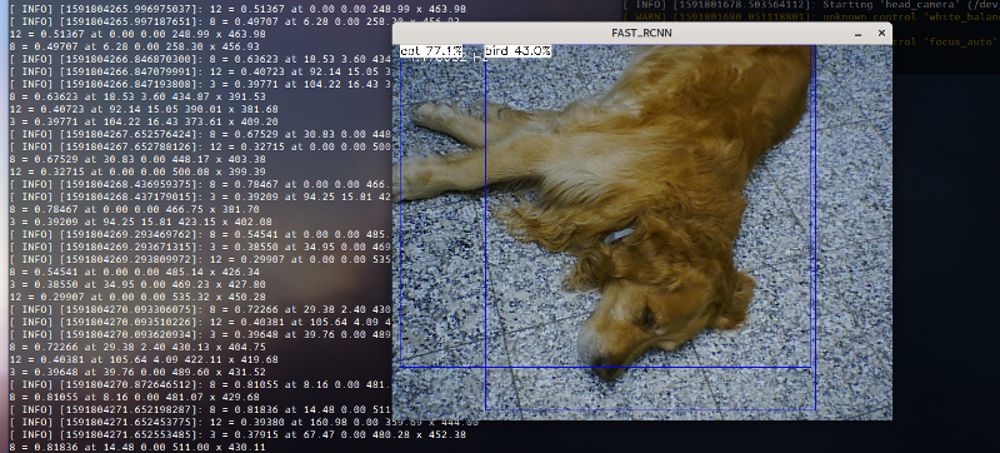

# ROS_NCNN #

This is a ROS package for NCNN, a high-performance neural network inference framework *- by Tencent -* optimized for mobile platforms:

- ARM NEON assembly level optimization
- Sophisticated memory management and data structure design, very low memory footprint
- Supports multi-core parallel computing acceleration
- Supports GPU acceleration via the next-generation low-overhead Vulkan API
- The overall library size is less than 700K, and can be easily reduced to less than 300K
- Extensible model design, supports 8bit quantization and half-precision floating point storage
- Can import caffe/pytorch/mxnet/onnx models


## Setting up ##

### Library ###

- [Build for NVIDIA Jetson](https://github.com/Tencent/ncnn/wiki/how-to-build#build-for-nvidia-jetson)
- [Build for Linux x86](https://github.com/Tencent/ncnn/wiki/how-to-build#build-for-linux-x86)
- [Build for Windows x64 using VS2017](https://github.com/Tencent/ncnn/wiki/how-to-build#build-for-windows-x64-using-visual-studio-community-2017)
- [Build for MacOSX](https://github.com/Tencent/ncnn/wiki/how-to-build#build-for-macosx)
- [Build for Raspberry Pi 3](https://github.com/Tencent/ncnn/wiki/how-to-build#build-for-raspberry-pi-3)
- [Build for ARM Cortex-A family with cross-compiling](https://github.com/Tencent/ncnn/wiki/how-to-build#build-for-arm-cortex-a-family-with-cross-compiling)
- [Build for Android](https://github.com/Tencent/ncnn/wiki/how-to-build#build-for-android)
- [Build for iOS on MacOSX with xcode](https://github.com/Tencent/ncnn/wiki/how-to-build#build-for-ios-on-macosx-with-xcode)
- [Build for iOS on Linux with cctools-port](https://github.com/Tencent/ncnn/wiki/how-to-build#build-for-ios-on-linux-with-cctools-port)
- [Build for Hisilicon platform with cross-compiling](https://github.com/Tencent/ncnn/wiki/how-to-build#build-for-hisilicon-platform-with-cross-compiling)


## ROS package ##

* Clone this repository into your catkin workspace.
* Initialize and update submodule `ncnn-assets` *( this is a collection of some popular models )*
* Compile the workspace.
* CMake script is going to autodetect whether the **ncnn library** is built with **Vulkan** or not. _( All nodes will utilize the GPU if Vulkan is enabled. )_

#### General launch parameters ####
```xml
<node name="yolact_node" pkg="ros_ncnn" type="yolact_node" output="screen">
  <param name="display_output" value="$(arg display_output)"/>
  <remap from="/camera/image_raw" to="$(arg camera_topic)"/>
  <!-- Select discrete GPU, in any other case the node jumps to the first discrete GPU. -->
  <param name="gpu_device" value="0"/>
  <!-- Number of CPU threads to use, uses all available if not provided. -->
  <param name="num_threads" value="8"/>
  <!-- Turns engine.neuralnet.opt.use_vulkan_compute regardless the lib is built with GPU support -->
  <param name="enable_gpu" value="true"/>
</node>
```

### YOLACT ###


**Publisher**
```yaml
# Object message
Header header
Rectangle boundingbox # Vector2D position and size
string label
float32 probability
```
**Params**
* _probability_threshold_ - default 0.5 - above which objects are published

### YOLO

The `assets` repository has multiple YOLO networks, choose the parameter and model file before launch. _( Default is YOLO-3 on MobileNet-2 )_

**Publisher**
```yaml
# Object message
Header header
Rectangle boundingbox # Vector2D position and size
string label
float32 probability
```
**Params**
* _model_file_ - YOLO network model file
* _param_file_ - YOLO network parameter file
* _probability_threshold_ - default 0.5 - above which objects are published

### RetinaFace ###


**Publisher**
```yaml
# FaceObject message
Header header
Rectangle boundingbox # Vector2D position and size
Vector2D[5] landmark # 5x 2x float32
float32 probability
```
**Params**
* _probability_threshold_ - default 0.5 - above which face objects are published


### PoseNet ###


### Faster R-CNN ###
Don't forget to uncompress `ZF_faster_rcnn_final.bin.zip` in assets directory first. _( but again, R-CNN is the past and that's neither a cat nor a bird right there... that's my best friend )_


## :construction:  To do ##

* General model loader node _( with layer to topic mapping through NDS file )_
* Dynamic reconfiguration for some params _( e.g. probability thresholds )_

## :v:  Acknowledgements ##
_Special thanks to **[Nihui](https://github.com/nihui)** for her wonderful work._
